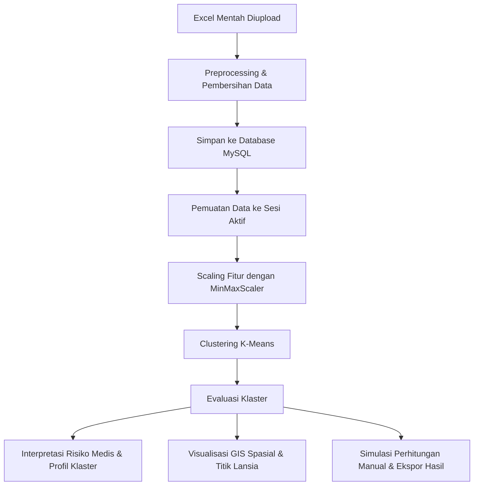

# 👴👵 Sistem Informasi & Clustering Risiko Kesehatan Lansia (K-Means + GIS)
### 📍 Puskesmas Tempeh, Kabupaten Lumajang, Jawa Timur

Selamat datang di repositori kode program **Sistem Informasi & Clustering Risiko Kesehatan Lansia**. Aplikasi ini merupakan platform dashboard interaktif berbasis web yang dikembangkan khusus untuk memetakan, menganalisis, dan mengelompokkan tingkat risiko kesehatan lanjut usia (lansia) di wilayah kerja Puskesmas Tempeh.

Sistem ini memadukan kekuatan **Algoritme K-Means Clustering** untuk pengelompokan data kesehatan secara objektif, **Evaluasi Metrik Klaster** (Silhouette Score, Davies-Bouldin Index, dan Calinski-Harabasz) untuk penjaminan mutu analisis, serta **Sistem Informasi Geografis (GIS)** spasial interaktif berbasis peta digital.

Aplikasi ini didesain secara modular, bersih, dan dilengkapi dengan fitur **simulasi perhitungan manual matematika** yang sangat membantu untuk keperluan penulisan metodologi penelitian atau bab analisis **Skripsi / Tugas Akhir**.

---

## 📌 Daftar Isi
- [1. Struktur Folder Project & Kegunaan](#1-struktur-folder-project--kegunaan)
  - [Folder Utama & File Konfigurasi](#folder-utama--file-konfigurasi)
  - [Struktur Folder `app/` (Kode Aplikasi Inti)](#struktur-folder-app-kode-aplikasi-inti)
- [2. Alur Kerja Aplikasi (Workflow)](#2-alur-kerja-aplikasi-workflow)
  - [Diagram Alir Sistem](#diagram-alir-sistem)
  - [Penjelasan Detail Langkah demi Langkah](#penjelasan-detail-langkah-demi-langkah)
- [3. Bagaimana Data Diinput (Mekanisme Preprocessing)](#3-bagaimana-data-diinput-mekanisme-preprocessing)
  - [Tantangan Data Excel Puskesmas](#tantangan-data-excel-puskesmas)
  - [Solusi Preprocessing "Tahan Banting"](#solusi-preprocessing-tahan-banting)
  - [Daftar Pemetaan Kolom Excel (COLUMN_INDEX_MAP)](#daftar-pemetaan-kolom-excel-column_index_map)
- [4. Bagaimana Output Dihasilkan (Mekanisme Clustering & Analisis)](#4-bagaimana-output-dihasilkan-mekanisme-clustering--analisis)
  - [A. Feature Scaling](#a-feature-scaling)
  - [B. Pemodelan K-Means](#b-pemodelan-k-means)
  - [C. Evaluasi Kualitas Cluster](#c-evaluasi-kualitas-cluster)
  - [D. Penentuan Tingkat Risiko (Composite Risk Score)](#d-penentuan-tingkat-risiko-composite-risk-score)
  - [E. Pemetaan Spasial GIS](#e-pemetaan-spasial-gis)
  - [F. Ekspor Dokumen & Simulasi Langkah Matematika](#f-ekspor-dokumen--simulasi-langkah-matematika)
- [5. Panduan Instalasi & Penggunaan](#5-panduan-instalasi--penggunaan)

---

## 📁 1. Struktur Folder Project & Kegunaan

Project ini mengadopsi pola arsitektur **Factory Pattern** yang umum pada aplikasi web Flask modern. Pembagian folder dibuat sangat terstruktur agar memisahkan antara logika pengolahan data (*core*), penyimpanan status sesi (*models*), rute halaman (*routes*), dan pembuatan output (*services*).

### Folder Utama & File Konfigurasi
* `run.py`: Titik masuk utama (*main entry point*) aplikasi. Menjalankan Flask development server lokal.
* `requirements.txt`: Berisi daftar semua library Python yang dibutuhkan oleh sistem (seperti Pandas, Scikit-Learn, Folium, ReportLab, Flask, PyMySQL).
* `README.md`: Dokumen panduan komprehensif ini yang menjelaskan alur kerja, folder, input, dan output sistem.
* `.env`: File konfigurasi rahasia (*environment variables*), berisi kunci enkripsi Flask dan string koneksi ke database MySQL.
* `uploads/`: Direktori tempat menyimpan file Excel rekam medis lansia yang diunggah oleh pengguna secara temporer.
* `logs/`: Berisi file `process.log` yang merekam aktivitas sistem, proses pembersihan data, serta log error untuk kebutuhan debugging.
* `data/`: Folder penyimpanan data pendukung sistem, khususnya file `desa_coordinates.json` yang berisi koordinat astronomis pusat masing-masing desa di Kecamatan Tempeh untuk pemetaan GIS.
* `outputs/`: Menyimpan dokumen hasil ekspor sementara (PDF atau Excel).

### Struktur Folder `app/` (Kode Aplikasi Inti)
Seluruh kode logika utama web berada di dalam folder `app/`, yang terbagi lagi menjadi:

```
project_lansia/
└── app/
    ├── __init__.py                 # Flask App Factory (Inisialisasi app, database, & rute)
    ├── extensions.py               # Instansiasi db (SQLAlchemy) & migrate
    │
    ├── core/                       # Inti Algoritme Machine Learning & Preprocessing
    │   ├── config.py               # Konfigurasi default (fitur, batas medis, dll.)
    │   ├── preprocessing.py        # Pembersihan data Excel, ekstraksi variabel, imputasi
    │   ├── clustering.py           # Pemodelan K-Means, perhitungan evaluasi, & interpretasi
    │   └── utils.py                # Fungsi utilitas (parser IMT, tekanan darah, log)
    │
    ├── models/                     # Representasi Data & Status Sesi
    │   ├── lansia.py               # Model ORM SQLAlchemy untuk tabel MySQL (Lansia, Batch)
    │   └── session_data.py         # Thread-safe in-memory singleton penampung status analisis aktif
    │
    ├── routes/                     # Penanganan Navigasi Web (Flask Blueprints)
    │   ├── dashboard.py            # Rute untuk statistik ringkasan dan dashboard utama
    │   ├── upload.py               # Rute untuk penanganan unggah file Excel
    │   ├── preprocessing.py        # Rute untuk melihat data bersih dan statistik missing values
    │   ├── clustering.py           # Rute untuk memicu K-Means dengan parameter K pilihan
    │   ├── evaluation.py           # Rute untuk melihat metrik Silhouette, DBI, CH, & Elbow
    │   ├── manual_calc.py          # Rute untuk melihat simulasi perhitungan manual matematika
    │   ├── gis.py                  # Rute untuk menampilkan peta spasial GIS interaktif
    │   ├── interpretation.py       # Rute untuk penjelasan profil klaster dan rekomendasi
    │   └── reports.py              # Rute untuk mengunduh laporan PDF dan Excel
    │
    ├── services/                   # Business Logic Layer (Penyaji data untuk UI)
    │   ├── db_service.py           # Logika penyimpanan & pembacaan data ke MySQL Laragon
    │   ├── preprocessing_service.py# Penghubung rute dengan pipeline preprocessing
    │   ├── clustering_service.py   # Menangani jalannya clustering & reduksi dimensi PCA
    │   ├── evaluation_service.py   # Menghitung evaluasi di berbagai nilai K untuk perbandingan
    │   ├── manual_calc_service.py  # Membuat simulasi langkah matematika K-Means & metrik evaluasi
    │   ├── gis_service.py          # Logika pembuatan peta spasial interaktif dengan Folium
    │   └── report_service.py       # Pembuatan laporan PDF print-ready dan file Excel klaster
    │
    ├── templates/                  # File HTML dengan template engine Jinja2
    └── static/                     # Aset statis web (CSS untuk styling dan Javascript)
```

---

## 🔄 2. Alur Kerja Aplikasi (Workflow)

Bagaimana sistem ini memproses data dari awal hingga akhir? Berikut adalah penjelasan alur data (*data flow*) secara runut.

### Diagram Alir Sistem


### Penjelasan Detail Langkah demi Langkah

1. **Inisialisasi Aplikasi**:
   * Pengguna menjalankan `run.py`. Flask memanggil `create_app()` dari `app/__init__.py`.
   * Sistem membaca berkas `.env`, menghubungkan ke database MySQL (`puskesmas_tempeh`), membuat tabel database secara otomatis jika belum ada (`db.create_all()`), serta memastikan seluruh folder penyimpanan (`uploads`, `logs`, `outputs`) telah siap.
2. **Pengunggahan File Excel (`uploads`)**:
   * Petugas Puskesmas mengunggah berkas laporan kesehatan lansia (.xlsx) melalui menu **Upload Data**.
   * File disimpan di folder `uploads` dengan nama batch unik.
3. **Proses Preprocessing Otomatis**:
   * Sistem memicu `preprocessing.py` untuk membaca Excel tersebut sheet demi sheet (tiap sheet mewakili satu Desa).
   * Data lansia dibersihkan dari merged cells, baris kosong, baris subtotal/rekapitulasi, dan dipetakan sesuai index kolom standar.
   * Variabel kesehatan seperti umur, IMT, tekanan darah (sistolik/diastolik), dan status laboratorium (Hb, Kolesterol, Gula Darah, Asam Urat) diekstraksi ke format numerik standar.
   * Missing value diisi menggunakan metode **Median per Desa** (atau median global jika satu desa tidak memiliki data sama sekali). *Pengecualian khusus: nilai laboratorium dibiarkan NaN untuk visualisasi GIS agar tetap akurat ("Tidak diukur"), namun saat clustering, NaN tersebut disubsitusi dengan median agar model K-Means tidak crash.*
   * Outliers dideteksi menggunakan metode **IQR (Interquartile Range)**.
   * Data bersih disimpan ke database MySQL melalui `db_service.py` untuk penyimpanan jangka panjang.
4. **Proses Clustering K-Means**:
   * Pengguna menentukan jumlah klaster $K$ (default: 3).
   * Fitur-fitur clustering diambil dari database, lalu dinormalisasi menggunakan `MinMaxScaler` ke rentang $[0, 1]$ agar fitur dengan rentang besar (misal Kolesterol $\sim 200$) tidak mendominasi fitur berrentang kecil (misal jenis kelamin $0-1$).
   * Model `KMeans` dari Scikit-Learn melatih data dan menetapkan setiap lansia ke salah satu klaster (0, 1, 2, dst).
   * Reduksi dimensi **PCA (Principal Component Analysis)** dijalankan untuk memproyeksikan data multi-dimensi (18 fitur) menjadi 2D agar bisa divisualisasikan dalam grafik scatter plot.
5. **Evaluasi Klaster**:
   * Sistem menghitung tiga metrik pengujian:
     * **Silhouette Score**: Menguji seberapa dekat suatu data dengan kelompoknya sendiri dibanding kelompok lain.
     * **Davies-Bouldin Index (DBI)**: Menguji rata-rata kemiripan klaster, di mana nilai lebih kecil berarti pemisahan klaster lebih optimal.
     * **Calinski-Harabasz Score**: Rasio dispersi antar-klaster dan di dalam klaster.
   * Nilai **Inertia** dihitung pada kisaran $K=1$ hingga $K=10$ untuk menghasilkan grafik **Elbow Method**, yang secara otomatis merekomendasikan jumlah $K$ paling efisien.
6. **Visualisasi Spasial (GIS Map)**:
   * Koordinat pusat desa diambil dari `desa_coordinates.json`.
   * Peta Leaflet/Folium di-generate. Setiap lansia dipetakan di sekitar desa asalnya menggunakan teknik *jittering* acak kecil agar posisi koordinat tidak bertumpuk di satu titik pusat desa.
   * Setiap marker diberi warna berdasarkan klaster risikonya dan memiliki popup interaktif berisi resume kesehatan klinis lansia tersebut (jika kolesterol kosong, ia dengan cerdas menampilkan "Tidak diukur" dan bukan nilai imputasi palsu).
7. **Simulasi Perhitungan Manual**:
   * Sistem menghitung ulang K-Means secara manual langkah-demi-langkah menggunakan sampel data kecil. Menampilkan inisialisasi centroid awal, perhitungan jarak Euclidean, pembaruan centroid iteratif, hingga hitungan metrik Silhouette/DBI secara detail menggunakan rumus matematika LaTeX yang cantik.
8. **Ekspor Hasil Laporan**:
   * Pengguna dapat mengunduh berkas laporan akhir dalam bentuk file Excel terstruktur atau dokumen cetak PDF resmi (*print-ready PDF*) yang berisi grafik, statistik klaster, dan rekomendasi intervensi.

---

## 📊 3. Bagaimana Data Diinput (Mekanisme Preprocessing)

Data rekam medis lansia dari Puskesmas biasanya diinput secara manual oleh kader posyandu menggunakan Microsoft Excel. Excel ini memiliki format yang sangat tidak ramah mesin pembaca data otomatis.

### Tantangan Data Excel Puskesmas
1. **Multi-header & Merged Cells**: Judul kolom sering kali digabung (*merged*), misalnya kolom "Usia" yang di bawahnya dibagi lagi menjadi kolom "45-59 L", "45-59 P", dll.
2. **Teks Non-standar**: Nilai tekanan darah ditulis "120/80 mmHg" atau "120-80". Nilai IMT ditulis "22.5 (N)" atau hanya BB/TB "50/150".
3. **Baris Sampah**: Terdapat baris total, subtotal, penjelasan tanda bintang, atau baris kosong di tengah-tengah tabel.

### Solusi Preprocessing "Tahan Banting"
Aplikasi ini memiliki algoritme parsing canggih di `app/core/preprocessing.py` yang mendeteksi header secara dinamis dengan melacak baris yang memiliki kata kunci `'No'` dan `'Nama Lansia'`. Kolom Excel dibaca berdasarkan **indeks posisi fisiknya (0-based)**, bukan berdasarkan teks headernya yang sering berubah-ubah.

### Daftar Pemetaan Kolom Excel (COLUMN_INDEX_MAP)
Sistem memetakan index kolom Excel fisik secara ketat ke dalam nama kolom database sebagai berikut:

| Indeks Kolom | Nama Kolom Sistem | Deskripsi / Cara Ekstraksi |
| :---: | :--- | :--- |
| **0** | `no` | Nomor urut data. Digunakan untuk mendeteksi awal baris data asli. |
| **1** | `nama_lansia` | Nama lengkap lansia (dibersihkan dari spasi berlebih). |
| **2** | `nik` | Nomor Induk Kependudukan (jika ada). |
| **3 - 4** | `kunjungan_baru` / `kunjungan_lama` | Menentukan status kunjungan lansia ke posyandu. |
| **5 - 10** | Usia Klasifikasi (`usia_...`) | Kolom kelompok umur (45-59 L/P, 60-69 L/P, ≥70 L/P). Sistem secara otomatis mengekstrak **umur** rill lansia dan menyimpulkan **jenis kelamin** (1.0 untuk Laki-laki, 0.0 untuk Perempuan) berdasarkan di mana tanda checklist berada. |
| **11 - 13** | IMT (`imt_L`, `imt_N`, `imt_K`) | Indeks Massa Tubuh. Sistem dapat mem-parse angka IMT langsung dari teks seperti "22(N)" atau menghitungnya dari berat badan (BB) dan tinggi badan (TB) jika tertulis "55/158" dengan rumus: $IMT = \frac{BB}{(TB/100)^2}$. |
| **14 - 16** | Tekanan Darah (`td_T`, `td_N`, `td_R`) | Tekanan darah lansia. String seperti "130/85" secara otomatis dipecah menjadi dua kolom terpisah: `td_sistolik` = 130.0 dan `td_diastolik` = 85.0. |
| **17 - 21** | Tingkat Kemandirian | Meliputi Mandiri (A), Ringan (B), Sedang (B), Berat (C), atau Total. Diekstrak menjadi status numerik kategori. |
| **22 - 27** | Skrining Integritas Fungsional (Skilas) | Skrining cepat kognitif, mobilitas, malnutrisi, penglihatan, pendengaran, dan depresi. Checklist diubah menjadi boolean numerik (1.0 = Ya/Ada Gangguan, 0.0 = Tidak/Normal). |
| **28 - 35** | Hasil Pemeriksaan Lab (Hb, Kolesterol, Gula Darah, Asam Urat) | Teks seperti "220(T)" atau "11.5(N)" di-parse menggunakan *regular expression* (regex) untuk mengambil angka numerik aslinya secara bersih. |
| **36 - 44** | Gangguan & Tindakan Medis | Mencakup gangguan paru, ginjal, status pengobatan (diobati/dirujuk), konseling, penyuluhan, dan pemberdayaan lansia. |

---

## 📈 4. Bagaimana Output Dihasilkan (Mekanisme Clustering & Analisis)

Setelah data dibersihkan, data tersebut masuk ke tahap komputasi matematika untuk menghasilkan visualisasi dan keputusan klinis.

### A. Feature Scaling
Sebelum K-Means dijalankan, 18 variabel utama lansia ditransformasikan menggunakan **MinMaxScaler**:
$$X_{scaled} = \frac{X - X_{min}}{X_{max} - X_{min}}$$
Langkah ini sangat krusial agar rentang nilai setiap variabel seragam di kisaran $[0, 1]$. Tanpa scaling, variabel dengan rentang nilai ratusan (seperti Kolesterol) akan mendominasi perhitungan jarak dibanding variabel biner yang bernilai $0$ atau $1$.

### B. Pemodelan K-Means
Algoritme K-Means meminimalkan jumlah kuadrat jarak antara data dengan centroid (pusat klaster) masing-masing kelompok:
$$J = \sum_{j=1}^{K} \sum_{i=1}^{n} ||x_i^{(j)} - c_j||^2$$
Di mana $x_i^{(j)}$ adalah data lansia ke-$i$ dan $c_j$ adalah centroid untuk klaster ke-$j$.
Jarak antar-lansia dihitung menggunakan **Euclidean Distance**:
$$d(x, y) = \sqrt{\sum_{i=1}^{m} (x_i - y_i)^2}$$

### C. Evaluasi Kualitas Cluster
Sistem memberikan penilaian objektif terhadap hasil pengelompokan menggunakan:
1. **Silhouette Score**: Mengukur tingkat kesesuaian penempatan objek dalam klasternya. Nilai berkisar antara $-1$ hingga $+1$. Semakin mendekati $1$, klaster terpisah dengan sangat baik.
2. **Davies-Bouldin Index (DBI)**: Menilai kerampingan klaster berdasarkan jarak di dalam klaster dan jarak antar-klaster. Semakin mendekati $0$, kualitas pengelompokan semakin sempurna.
3. **Calinski-Harabasz Score**: Menilai kelayakan model berdasarkan kepadatan dan pemisahan antar-klaster. Nilai yang lebih tinggi menunjukkan klaster yang lebih baik.

### D. Penentuan Tingkat Risiko (Composite Risk Score)
Sistem secara cerdas menginterpretasikan klaster K-Means ke dalam tingkat risiko medis nyata (**Tinggi, Sedang, Rendah**) melalui perhitungan **Composite Risk Score** (skor klinis tertimbang):

* **Umur**: Usia $\ge 75$ (+2.0), $\ge 70$ (+1.5), $\ge 65$ (+1.0), $\ge 60$ (+0.5).
* **IMT**: Obesitas ekstrem atau gizi buruk (+2.0), overweight/kurang gizi (+1.0).
* **Tekanan Darah**: Sistolik $\ge 160$ (+3.0), Diastolik $\ge 100$ (+2.0) — indikasi hipertensi berat.
* **Laboratorium**: Kolesterol $\ge 200$ (+1.5), Gula Darah $\ge 200$ (+1.5), Hb Rendah (+1.5), Asam Urat Tinggi (+1.0).
* **Fungsional**: Malnutrisi (+1.5), Keterbatasan Mobilitas (+1.5), Gangguan Ginjal/Paru (+2.0).

Rata-rata skor risiko kumulatif dari lansia di masing-masing klaster dibandingkan secara otomatis. Klaster dengan rata-rata skor tertinggi dinobatkan sebagai **"Klaster Risiko Tinggi (Merah)"**, diikuti oleh **"Risiko Sedang (Kuning)"**, dan **"Risiko Rendah (Hijau)"**.

### E. Pemetaan Spasial GIS
* **Pencegahan Tumpukan Marker (Jittering)**: Karena data lansia dari Puskesmas hanya mencantumkan nama Desa (tanpa alamat GPS presisi rumah masing-masing), sistem memetakan mereka berdasarkan koordinat pusat desa asal yang terdaftar di `desa_coordinates.json`.
* Agar ratusan marker lansia di satu desa tidak bertumpuk di satu titik koordinat yang sama, sistem menambahkan **nilai acak sangat kecil (Gaussian Jitter)** pada koordinat latitude dan longitude:
  $$\text{Lat}_{new} = \text{Lat}_{center} + \epsilon_x, \quad \text{Lon}_{new} = \text{Lon}_{center} + \epsilon_y$$
  Hal ini menciptakan persebaran visual melingkar yang indah di sekitar pusat desa asli di peta.
* **Filter Interaktif**: Peta dilengkapi dengan filter klaster, pencarian nama lansia, deteksi kolesterol tinggi (berwarna merah khusus), dan visualisasi heatmap kepadatan sebaran lansia risiko tinggi.

### F. Ekspor Dokumen & Simulasi Langkah Matematika
* **Ekspor PDF & Excel**: `report_service.py` menyusun data klaster menjadi file Excel rapi untuk dinas kesehatan, serta berkas PDF formal yang berisi logo instansi, tabel statistik, bagan visualisasi, dan rekomendasi program intervensi spesifik untuk masing-masing kelompok risiko.
* **Simulasi Manual Matematika**: `manual_calc_service.py` menyajikan simulasi transparan yang menjelaskan proses matematika K-Means langkah demi langkah dari inisialisasi centroid awal hingga konvergensi akhir, lengkap dengan matriks jarak detail untuk mempermudah pemahaman konsep algoritma.

---

## 🚀 5. Panduan Instalasi & Penggunaan

### Prasyarat
Pastikan komputer Anda sudah terinstal:
- **Python 3.10+** → [Download Python](https://www.python.org/downloads/)
- **Git** → [Download Git](https://git-scm.com/downloads)
- **MySQL Server** (via Laragon / XAMPP / MySQL Installer) — pastikan MySQL service berjalan di background

### Langkah 1: Clone Repository dari GitHub
Buka terminal (Command Prompt / PowerShell / Git Bash), lalu jalankan:
```bash
git clone https://github.com/USERNAME/project_lansia.git
cd project_lansia
```
> ⚠️ Ganti `USERNAME` dengan username GitHub yang sesuai.

### Langkah 2: Buat Virtual Environment
Buat virtual environment Python agar dependency terisolasi:
```bash
python -m venv .venv
```

Aktifkan virtual environment:
* **Command Prompt (CMD)**:
  ```cmd
  .venv\Scripts\activate
  ```
* **PowerShell**:
  ```powershell
  .venv\Scripts\Activate.ps1
  ```
* **Git Bash / Linux / macOS**:
  ```bash
  source .venv/bin/activate
  ```

### Langkah 3: Install Semua Dependency
Setelah virtual environment aktif (terlihat `(.venv)` di awal terminal), jalankan:
```bash
pip install -r requirements.txt
```

### Langkah 4: Konfigurasi Environment Variables
Salin file template `.env.example` menjadi `.env`:
```bash
copy .env.example .env
```
> Pada Linux/macOS gunakan: `cp .env.example .env`

Buka file `.env` dengan text editor, lalu sesuaikan konfigurasi database:
```env
FLASK_SECRET_KEY=lansia-clustering-secret-key-2026
SQLALCHEMY_DATABASE_URI=mysql+pymysql://root:@localhost:3306/puskesmas_tempeh?charset=utf8mb4
```
> ⚠️ Sesuaikan `root:` (user:password) dan `localhost:3306` dengan konfigurasi MySQL Anda.

### Langkah 5: Buat Database MySQL
Pastikan MySQL sudah berjalan (Laragon/XAMPP aktif), lalu buat database melalui command line atau phpMyAdmin:
```sql
CREATE DATABASE puskesmas_maesan CHARACTER SET utf8mb4 COLLATE utf8mb4_unicode_ci;
```
> Tabel-tabel akan dibuat secara otomatis saat aplikasi pertama kali dijalankan.

### Langkah 6: Jalankan Aplikasi
```bash
python run.py
```
Atau tanpa mengaktifkan virtual environment terlebih dahulu:
```bash
.venv\Scripts\python run.py
```

### Langkah 7: Buka di Browser
Setelah server lokal menyala, buka browser web favorit Anda (Chrome/Firefox/Edge) dan akses:

👉 [**http://127.0.0.1:5000/**](http://127.0.0.1:5000/)

### Cara Penggunaan Fitur di Dashboard Web:
1. **Upload Data**: Unggah berkas laporan bulanan lansia (.xlsx) hasil ekspor posyandu.
2. **Preprocessing**: Periksa hasil pembersihan data, statistik *missing values* sebelum/sesudah imputasi, serta deteksi *outliers*.
3. **Clustering**: Pilih jumlah $K$ klaster yang diinginkan (default $3$ klaster untuk mewakili Risiko Tinggi, Sedang, Rendah). Tekan tombol "Jalankan Clustering".
4. **Evaluasi**: Amati grafik Silhouette Score dan grafik Elbow Method untuk membuktikan keilmiahan pemilihan jumlah $K$ Anda.
5. **Peta GIS**: Buka visualisasi spasial untuk melihat pemetaan sebaran lansia per desa secara geografis.
6. **Interpretasi & Laporan**: Baca penjelasan profil klinis masing-masing klaster dan unduh file PDF/Excel untuk bahan lampiran Skripsi Anda.
7. **Perhitungan Manual**: Manfaatkan halaman simulasi manual untuk memahami dengan detail rumus matematika di balik algoritme.

---
*Sistem dikembangkan dengan dedikasi penuh untuk mendukung efektivitas pemetaan kesehatan lansia di Puskesmas Tempeh serta membantu mahasiswa dalam menyelesaikan penelitian akademis dengan transparansi metodologi yang tinggi.*

