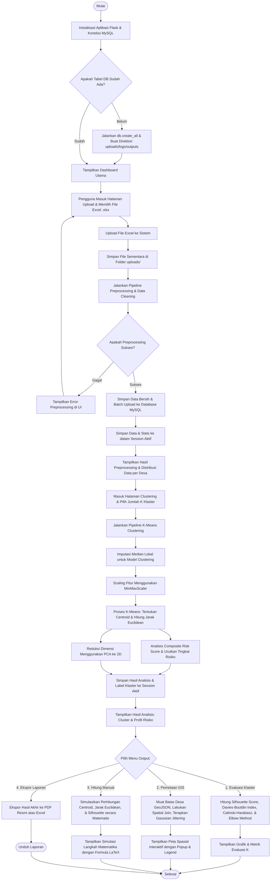
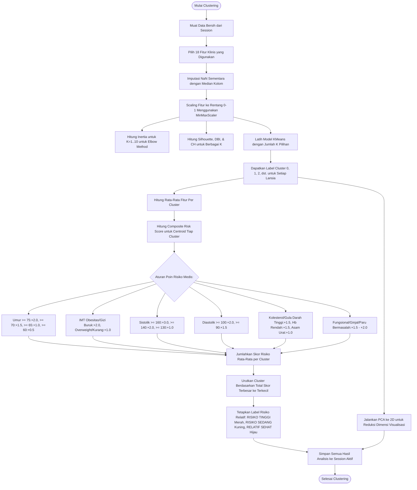

# 📊 Flowchart Sistem Lengkap: Clustering Risiko Kesehatan Lansia (K-Means + GIS)

Dokumen ini menyajikan flowchart sistem secara lengkap dari awal hingga akhir, yang menggambarkan bagaimana data kesehatan lansia diproses dari file Excel mentah, dibersihkan melalui pipeline preprocessing, disimpan di database MySQL, dianalisis menggunakan algoritma K-Means Clustering, dievaluasi kualitas klasternya, dipetakan secara spasial menggunakan GIS (Folium), hingga disimulasikan dan diekspor ke dalam bentuk laporan.

---

## 🔄 1. Diagram Alir Utama (End-to-End System Flow)

Berikut adalah diagram alir proses sistem dari interaksi pengguna (User/Petugas) di Web UI hingga menghasilkan visualisasi dan dokumen laporan.

---

## 🧹 2. Flowchart Sub-Proses: Preprocessing & Data Cleaning (`preprocessing.py`)

Bagian ini menjelaskan langkah detail bagaimana file Excel mentah yang diunggah oleh petugas Puskesmas dibersihkan dan divalidasi oleh sistem sebelum dimasukkan ke database.

```mermaid
flowchart TD
    StartPrep([Mulai Preprocessing]) --> ReadExcel[baca_data: Baca File Excel Menggunakan pandas usecols]
    ReadExcel --> RenameCols[pilih_dan_rename_kolom: Rename Kolom ke Format snake_case]
    
    RenameCols --> CleanStr[Strip Whitespace & Ganti string kosong/'nan'/'None' dengan NaN]
    CleanStr --> CleanNum[Ubah Kolom Numerik ke Float/Int & Hapus Karakter Non-Numerik]
    CleanNum --> ZeroToNaN[Ganti Nilai 0 pada Gula Darah dengan NaN]
    ZeroToNaN --> DateConv[Konversi tanggal_lahir ke Tipe Datetime]
    DateConv --> DropDup[Hapus Baris Duplikat Berdasarkan NIK]
    DropDup --> FilterKec[Filter Data: Hanya Ambil Data Lansia di Kecamatan Maesan]
    
    FilterKec --> CalcAge[buat_fitur_baru: Hitung umur = tahun_sekarang - tahun_lahir]
    CalcAge --> CalcBMI[Hitung imt = berat_badan / tinggi_badan_m^2]
    
    CalcBMI --> EncodeJK[encode_kategorikal: Jenis Kelamin L=1, P=0]
    EncodeJK --> EncodeHT[Encode Riwayat Hipertensi Ya=1, Tidak=0]
    EncodeHT --> EncodeCog[Encode Gangguan Kognitif Ya=1, Tidak=0]
    EncodeCog --> EncodeMal[Encode Malnutrisi Ya=1, Tidak=0]
    EncodeMal --> EncodeDep[Encode Depresi Ada Gejala=1, Tidak Ada=0]
    
    EncodeDep --> DropNullCols{Apakah null kolom > COL_MISSING_THRESHOLD?}
    DropNullCols -- Ya --> DropCol[Hapus Kolom Tersebut dari Dataset] --> DropNullRows
    DropNullCols -- Tidak --> DropNullRows{Apakah null baris > ROW_MISSING_THRESHOLD?}
    
    DropNullRows -- Ya --> DropRow[Hapus Baris Tersebut dari Dataset] --> RangeValidation
    DropNullRows -- Tidak --> RangeValidation[validasi_data: Validasi Rentang Nilai Medis]
    
    RangeValidation --> CheckRange{Apakah Nilai di Luar Batas Medis?}
    CheckRange -- Ya --> SetNaN[Set Nilai Menjadi NaN] --> SortOutput
    CheckRange -- Tidak --> SortOutput[siapkan_output: Urutkan Berdasarkan Desa & Kecamatan, Hapus Kolom Bantu]
    
    SortOutput --> EndPrep([Selesai Preprocessing])
```

---

## 🧮 3. Flowchart Sub-Proses: K-Means Clustering & Risk Profiling (`clustering.py`)

Bagian ini menggambarkan bagaimana data bersih diubah menjadi kelompok risiko menggunakan metode K-Means dan dianalisis tingkat keparahannya berdasarkan aturan medis (Composite Risk Score).

---

## 🗺️ 4. Flowchart Sub-Proses: Visualisasi Spasial GIS (`gis_service.py`)

Bagian ini mendeskripsikan alur integrasi data hasil clustering dengan data geospasial batas desa untuk dirender di peta interaktif.

```mermaid
flowchart TD
    StartGIS([Mulai GIS]) --> LoadGeoJSON[Muat File batas_desa_maesan.geojson Menggunakan Geopandas]
    LoadGeoJSON --> EnsureCRS[Pastikan CRS dalam Format EPSG:4326]
    
    EnsureCRS --> GetClusterData[Ambil Data Hasil Clustering Lansia]
    GetClusterData --> AggregateDesa[Hitung Jumlah Lansia Sehat, Sedang, Tinggi per Desa]
    
    AggregateDesa --> SpatialJoin[Lakukan Spatial Join antara Polygon GeoJSON & Hasil Agregasi Desa]
    SpatialJoin --> CheckUnmatched{Apakah Ada Desa Tidak Cocok?}
    CheckUnmatched -- Ya --> FallbackMerge[Lakukan Pencocokan Alternatif Menggunakan Nama Kolom Kedua] --> FillNaN
    CheckUnmatched -- Tidak --> FillNaN[Isi Nilai Desa Tanpa Data dengan 0]
    
    FillNaN --> CalcPct[Hitung Persentase Sehat/Sedang/Tinggi/Risiko Kumulatif per Desa]
    
    CalcPct --> CreateFolium[Inisialisasi Peta Folium & Muat Peta Satelit Esri]
    
    CreateFolium --> AddPolygons[Loop Setiap Fitur Polygon Desa:]
    AddPolygons --> GetFillColor[Tentukan Warna Isi Desa Berdasarkan Persentase Filter Aktif]
    GetFillColor --> RenderPolygon[Gambarkan Batas Wilayah Desa di Peta]
    RenderPolygon --> AddTooltip[Tambahkan Tooltip Hover & Popup Detail Statistik Lansia]
    
    AddTooltip --> JitterPoints[Loop Setiap Data Lansia:]
    JitterPoints --> CheckCoords{Apakah Titik Lansia Bertumpuk di Pusat Desa?}
    CheckCoords -- Ya --> ApplyJitter[Terapkan Gaussian Jittering: Lat/Lon + epsilon acak] --> RenderMarker
    CheckCoords -- Tidak --> RenderMarker[Gambarkan Marker Lansia di Peta Sesuai Warna Risiko]
    
    RenderMarker --> AddLegend[Tambahkan Legend Peta Interaktif]
    AddLegend --> SaveHTML[Simpan Output Peta ke Format HTML]
    SaveHTML --> EndGIS([Selesai GIS])
```

---

## 📋 5. Ringkasan Keterkaitan File Program dalam Alur Kerja

Untuk membantu pemetaan alur di dalam kode program, berikut adalah ringkasan file-file yang terlibat secara langsung dari awal hingga akhir:

| Urutan Langkah | File yang Terlibat | Fungsi Utama dalam Sistem |
| :--- | :--- | :--- |
| **1. Entry Point** | [run.py](file:///c:/Punya%20Ajhiezu/SKRIPSI/lansia_klustering/run.py) & [app/\_\_init\_\_.py](file:///c:/Punya%20Ajhiezu/SKRIPSI/lansia_klustering/app/__init__.py) | Menjalankan server, memuat konfigurasi `.env`, inisialisasi koneksi MySQL database, dan registrasi blueprint routing. |
| **2. Upload** | [app/routes/upload.py](file:///c:/Punya%20Ajhiezu/SKRIPSI/lansia_klustering/app/routes/upload.py) & [app/services/preprocessing_service.py](file:///c:/Punya%20Ajhiezu/SKRIPSI/lansia_klustering/app/services/preprocessing_service.py) | Menangani penerimaan file Excel `.xlsx` yang diunggah dan menyimpannya di folder `uploads/`. |
| **3. Preprocessing** | [app/core/preprocessing.py](file:///c:/Punya%20Ajhiezu/SKRIPSI/lansia_klustering/app/core/preprocessing.py) | Membersihkan data, konversi tipe data, menghitung variabel turunan (Umur & IMT), imputasi biner, dan validasi rentang medis. |
| **4. Database Save** | [app/services/db_service.py](file:///c:/Punya%20Ajhiezu/SKRIPSI/lansia_klustering/app/services/db_service.py) & [app/models/lansia.py](file:///c:/Punya%20Ajhiezu/SKRIPSI/lansia_klustering/app/models/lansia.py) | Menyimpan data lansia bersih dan metadata batch unggahan ke dalam tabel MySQL. |
| **5. Clustering** | [app/core/clustering.py](file:///c:/Punya%20Ajhiezu/SKRIPSI/lansia_klustering/app/core/clustering.py) & [app/services/clustering_service.py](file:///c:/Punya%20Ajhiezu/SKRIPSI/lansia_klustering/app/services/clustering_service.py) | Melakukan scaling data, fitting model K-Means, reduksi dimensi PCA, dan analisis Composite Risk Score untuk mengurutkan risiko klaster. |
| **6. Evaluation** | [app/routes/evaluation.py](file:///c:/Punya%20Ajhiezu/SKRIPSI/lansia_klustering/app/routes/evaluation.py) | Menampilkan grafik Elbow Method dan performa Silhouette Score untuk memvalidasi pemilihan jumlah klaster. |
| **7. GIS Mapping** | [app/services/gis_service.py](file:///c:/Punya%20Ajhiezu/SKRIPSI/lansia_klustering/app/services/gis_service.py) | Memadukan polygon GeoJSON desa dengan hasil sebaran klaster lansia, menggambar peta choropleth dan marker menggunakan Folium. |
| **8. Manual Simulation** | [app/services/manual_calc_service.py](file:///c:/Punya%20Ajhiezu/SKRIPSI/lansia_klustering/app/services/manual_calc_service.py) | Menyajikan simulasi langkah-demi-langkah perhitungan centroid, jarak Euclidean, dan Silhouette Score dalam LaTeX. |
| **9. Reports & Export** | [app/services/report_service.py](file:///c:/Punya%20Ajhiezu/SKRIPSI/lansia_klustering/app/services/report_service.py) | Menyusun data klaster menjadi file Excel terstruktur atau dokumen PDF resmi yang siap cetak (*print-ready*). |
